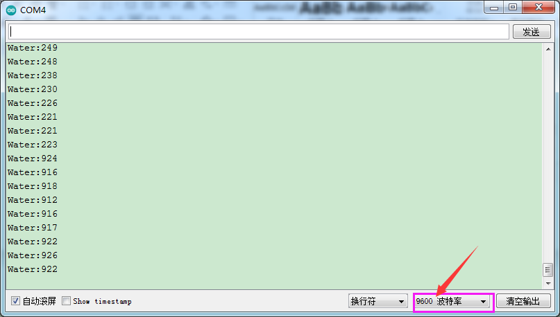

# Arduino


## 1. Arduino简介  

Arduino是一种开源电子原型平台，具有灵活的硬件和软件架构，广泛应用于Arduino项目、教育和快速原型开发。通过编程语言（如Arduino C/C++），用户能够控制各种输入和输出设备，包括传感器、马达、LED等。Arduino不仅提供易于使用的开发环境和大量的库支持，还具有活跃的社区，使得每个学习者和开发者能够快速实现其创意。Arduino适用于多种项目，从简单的家居自动化到复杂的机器人技术，具有广泛的应用潜力。  

## 2. 接线图  

  

## 3. 测试代码（测试软件版本：arduino-1.8.12）  

```cpp  
void setup() {  
    Serial.begin(9600); // 设置波特率  
}  

void loop() {  
    int sensorValue = analogRead(A0); // 读取到的A0的数值，并赋值给数字变量sensorValue  
    Serial.println(sensorValue, DEC); // 显示sensorValue数值，并自动换行  
}  
```  

## 4. 代码说明  

1. 在实验中，我们定义管脚变量名为sensorValue，表示模拟值，它输出的是模拟值（0~1023），因此我们将管脚设置为模拟口，这里接至A0。  

2. `analogRead(pin)`函数用于从指定的模拟引脚pin读取值。Arduino板包含一个多通道、10位模数转换器，将输入电压（0到工作电压5V或3.3V，这里是5V）映射为0到1023之间的整数值。例如，在Arduino UNO上，这会产生5伏/1024单位的读数分辨率，即每单位约为0.0049伏（4.9 mV）。在基于ATmega的板卡（如UNO、Nano、Mini、Mega等）上，读取模拟输入约需100微秒，因此最大读取速率约为每秒10,000次。  

3. `pin`参数是指要读取的模拟输入引脚的名称（大多数板上的A0到A5，而在Plus板上的A0到A7，Mega2560上的A0到A15）。我们设置了一个整数变量item，将测量结果赋值给item。该函数的返回值为引脚上的模拟读数，受限于模数转换器的分辨率（在0到1023之间为10位或在0到4095之间为12位）。数据类型为int。  

4. 在串口监视器中显示sensorValue的值，显示前需设置波特率（默认设置为9600，可根据需要更改）。  

## 5. 测试结果  

烧录好测试代码，并按照接线图连接好线；使用USB接口供电后，进入串口监视器并设置波特率为9600。当水蒸气传感器检测到水分时，输出的模拟值将显示在串口监视器中。水量越多，输出的电压越大，相应的模拟值也会增大，如下图所示。  




