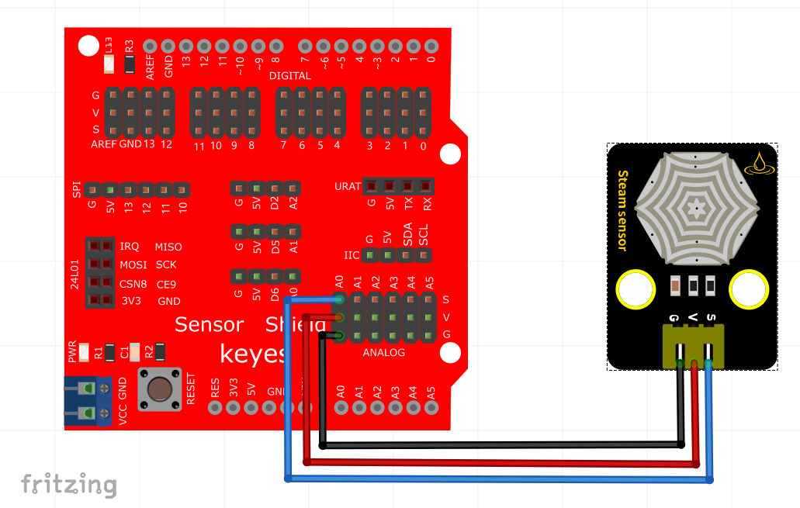
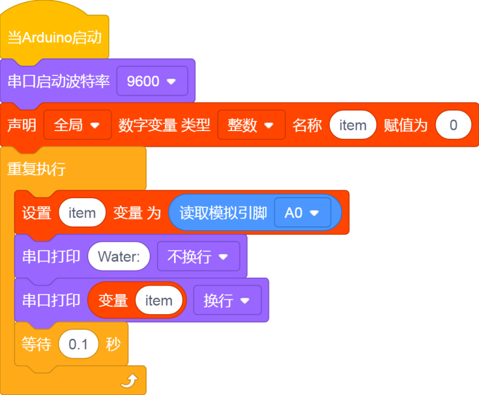
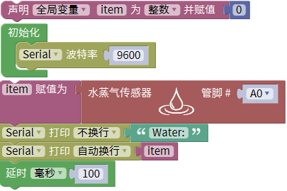
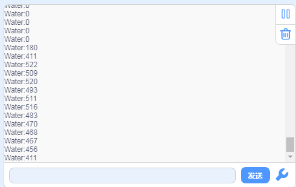

# KidsBlock

## 1. KidsBlock简介  

KidsBlock是一款专为儿童和编程初学者设计的可视化编程平台，通过简单的拖放界面，用户能够轻松创建逻辑代码，掌握编程的基本概念。该平台支持多种编程语言，例如Scratch和Arduino C，使其适用于各种创意项目，如传感器控制、灯光效果以及简单的机器人项目。KidsBlock还提供丰富的模块、示例和教学资源，能够有效激发学生的兴趣，帮助他们在游戏中学习编程和电子基础知识。  

## 2. 接线图  

  

## 3. 测试代码  

  

## 4. 代码说明  

1. 在实验中，我们需要创建一个整数变量名为item，该变量用于存储传感器读取的模拟值。  

2. 使用`analogRead()`函数读取的模拟值被赋给变量item，并在串口监视器中显示item的值。  

## 5. 测试结果  

成功烧录测试代码，并按照接线图连接好各个部分，使用USB接口供电。当水蒸气传感器检测到水分时，串口监视器将显示输出的模拟值，水分越多，模拟值越大，如下图所示。  

