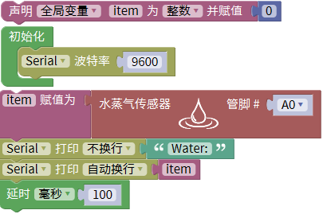

# Mixly

## 1. Mixly简介  

Mixly是一款基于图形化编程的开发环境，旨在使编程学习更加直观和有趣。它允许用户通过拖放代码块的方式来创建Arduino项目，适合初学者和儿童使用。Mixly支持多种编程语言，包括Scratch和Arduino C，使其灵活多样。用户可以通过图形化的方式控制硬件，如传感器、LED灯和电机，体验编程的乐趣。Mixly还附带丰富的例子和模块，帮助用户逐步掌握编程、电子电路以及机器人技术。  

## 2. 接线图  

  

## 3. 测试代码（测试软件版本：Mixly 1.2.0）  

  

## 4. 代码说明  

1. 在实验中，我们需要创建一个整数变量名为item，用于存储水蒸气传感器的模拟值。  

2. 初始化波特率设置，虽然在使用串口打印时可以不手动设置，但代码块已经自动处理了波特率的设置。  

3. 在导入的库keyes sensor下找到“模拟输入”单元，选择水蒸气传感器模块，管脚接至模拟口A0，因此不需要更改。  

4. 读取的模拟值赋值给变量item，并在串口监视器中显示item的值（默认波特率为9600，可以更改）。  

5. 在每次循环后延时100毫秒，以降低观察的频率。  

## 5. 测试结果  

烧录好测试代码，按照接线图连接好线；使用USB接口供电后，进入串口监视器并设置波特率为9600。当水蒸气传感器检测到水分时，串口监视器将显示输出的模拟值，水分越多，模拟值越大，如下图所示。  

