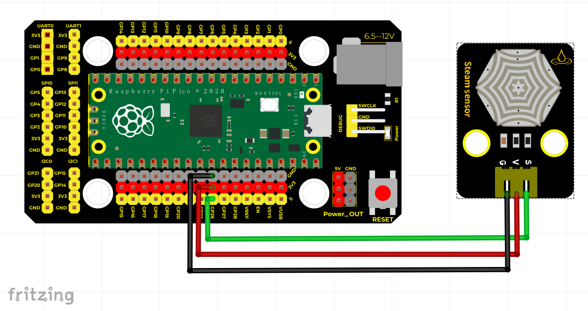
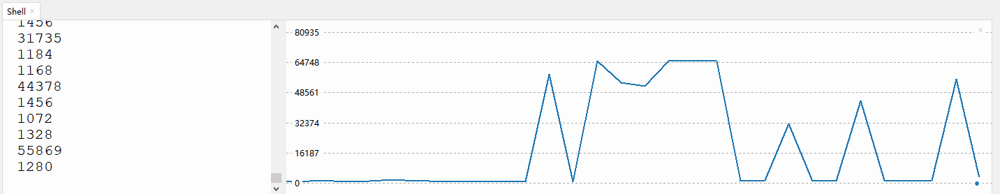

# Python


## 1. Python简介  

Python是一种广泛使用的高级编程语言，以简洁易读的语法而闻名，自1991年推出以来便成为许多领域的首选。Python支持多种编程范式，包括面向对象编程、过程化编程和函数式编程，适合用于Web开发、数据分析、机器学习、自动化等各种应用。该语言的强大之处在于其丰富的标准库和活跃的社区，开发者可以利用大量第三方库（如NumPy、Pandas、Matplotlib等）来提升工作效率，同时Python的跨平台特性使得其能够在不同操作系统上运行。此外，Python汇集了众多教育资源，使得它特别适合于编程初学者。  

## 2. 接线图  

  

## 3. 测试代码（测试软件：Thonny）  

```python  
import utime  

potentiometer = machine.ADC(26)  # 将GP26作为模拟信号采集引脚  

while True:  
    voltage = potentiometer.read_u16()  # 读取模拟值  
    print(voltage)  # 打印模拟值  
    utime.sleep(0.1)  # 延时0.1秒  
```  

## 4. 代码说明  

1. 在该代码中，`machine.ADC(26)` 用于将GP26引脚配置为模拟输入，使其能够读取来自传感器的模拟信号。  

2. `while True:` 循环用于持续读取传感器的电压值，直到手动停止程序。  

3. `potentiometer.read_u16()` 函数用于读取引脚的模拟信号，其返回一个0到65535的整数值，表示传感器电压（16位分辨率）的当前状态。  

4. `print(voltage)` 语句用于将读取到的电压值输出到Thonny的终端窗口，便于观察传感器的工作状态。  

5. `utime.sleep(0.1)` 函数用于设置每次读取之间的延时，避免输出值过快，从而影响观察。  

## 5. 测试结果  

在完成接线并上传代码后，运行程序。在Thonny下的串口监视器中，通过按压压力传感器，可以观察到输出的模拟值逐渐增大，从而确认传感器正常工作，如下图所示。  




